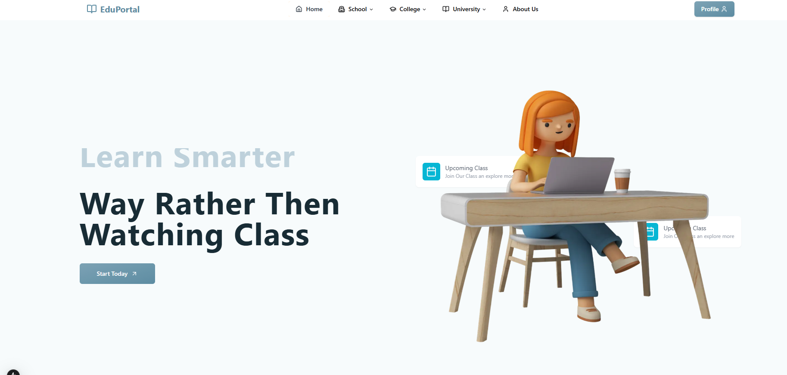

<div align="center">
 <br />
    

  <br /> 

  <div>
    
    
    
    
    
    
     
  </div>


  
</div>

### Salles Note - A Note Selling Platform

Build this project step by step with our detailed tutorial on **Your Channel Name** YouTube. Join our community!

## 📋 Table of Contents

1. 🤖 Introduction
2. ⚙️ Tech Stack
3. 🔋 Features
4. 🤸 Quick Start
5. 🔗 Links
6. 🚀 More

## 🚨 Tutorial

This repository contains the code for Salles Note, corresponding to an in-depth tutorial available on our YouTube channel, **Your Channel Name**.

If you prefer visual learning, this is the perfect resource for you. Follow our tutorial to learn how to build projects like these step-by-step in a beginner-friendly manner!

## 🤖 Introduction

Salles Note is a full-stack web application designed for buying and selling educational notes. With a sleek, modern interface, users can browse and purchase high-quality notes, while admins can upload and manage content effortlessly. Built with Next.js, NestJS, TypeScript, Tailwind CSS, Cloudinary, and JWT for role-based authentication, Salles Note ensures a secure and seamless experience.

Join our vibrant community for support, bug fixes, or collaboration. Our active Discord server is home to thousands of developers ready to help!

## ⚙️ Tech Stack

- Next.js
- NestJS
- TypeScript
- Tailwind CSS
- Cloudinary
- JSON Web Token (JWT)

## 🔋 Features

👉 **Sleek & Modern Interface**: A responsive, visually appealing design powered by Tailwind CSS for an engaging user experience.

👉 **Role-Based Authentication**: Secure JWT-based login system supporting user and admin roles with access and refresh tokens.

👉 **Note Browsing & Purchasing**: Users can explore notes, filter by category, and purchase securely.

👉 **Admin Note Management**: Admins can upload, edit, and delete notes, leveraging Cloudinary for efficient file storage.

👉 **Secure File Storage**: Notes are stored on Cloudinary, ensuring fast access and reliability.

👉 **User Profile Dashboard**: Users can view purchased notes and manage their profiles.

👉 **Robust Backend APIs**: NestJS-powered backend with API routes for authentication, note management, and file uploads.

👉 **Scalable Codebase**: Modular architecture for easy maintenance and future scalability.

and many more, including optimized performance and reusable components.

## 🤸 Quick Start

Follow these steps to set up the project locally on your machine.

**Prerequisites**

Make sure you have the following installed:

- Git
- Node.js
- npm (Node Package Manager)

**Cloning the Repository**

```bash
git clone https://github.com/your-username/salles-note.git
cd salles-note
```

**Installation**

Install the project dependencies for both frontend and backend:

```bash
# Install frontend dependencies
cd project-sheet
npm install

# Install backend dependencies
cd project-sheet-backend
npm install
```

**Set Up Environment Variables**

Create a `.env` file in both the `frontend` and `backend` directories with the following content:

**Frontend (.env)**

```env
BASE_URL = 
```

**Backend (.env)**

```env
MONGODBURL =
ACCESS_TOKEN =
REFRESH_TOKEN =
JWT_SECRET =
Api_secrate =
api_key = 
cloud_name =

```

Replace placeholder values with your actual credentials from Cloudinary. Generate secure secrets for `ACCESS_TOKEN_SECRET`, `REFRESH_TOKEN_SECRET`, and `NEXTAUTH_SECRET` using a tool like crytool.

**Running the Project**

1. Start the backend server:

```bash
cd project-sheet-backend
npm run start:dev
```

2. Start the frontend server:

```bash
cd project-sheet
npm run dev
```

Open http://localhost:3000 in your browser to view the project.

## 🔗 Links

- Demo Link
- Assets

## 🚀 More

**Advance your skills with our Next.js and NestJS Pro Course**

Enjoyed creating this project? Dive deeper into our PRO courses for a richer learning adventure. They're packed with detailed explanations, advanced features, and exercises to boost your skills. Give it a go!

**Accelerate your professional journey with our Expert Training program**

Want to tackle real-world tech challenges? Join our personalized masterclass to learn best practices, advanced web skills, and receive mentorship to boost your confidence. Let's grow together!